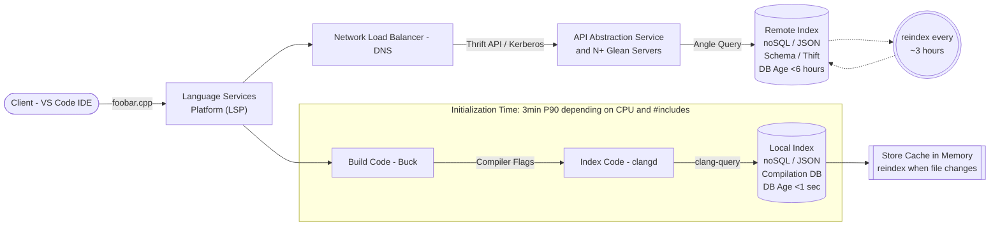

```mermaid
flowchart LR
    %% Define the clients
    ClientVSCode(["Client - VS Code IDE"])
    LanguageServer["Language Services 
    Platform (LSP)"]

    %% Define the remote index components
    NLB["Network Load Balancer - DNS"]
    GleanService["API Abstraction Service
    and N+ Glean Servers"]
    GleanDB[("Remote Index
    noSQL / JSON
    Schema / Thift
    DB Age <6 hours")]
    GleanIndexer((("reindex every
    ~3 hours")))

    %% Define the remote index flow
    ClientVSCode --> |foobar.cpp|LanguageServer --> NLB
    NLB --> |Thrift API / Kerberos|GleanService --> |Angle Query|GleanDB -.-> GleanIndexer -.->GleanDB

    %% Define the local index components
    Buck["Build Code - Buck"]
    clangd["Index Code - clangd"]
    clangdDB[("Local Index
    noSQL / JSON
    Compilation DB
    DB Age <1 sec")]
    clangdMemCache[["Store Cache in Memory
    reindex when file changes"]]

    %% Define the local index flow
    LanguageServer --> Buck
    subgraph Initialization Time: 3min P90 depending on CPU and #includes
    Buck --> |Compiler Flags|clangd --> |clang-query|clangdDB
    end
    clangdDB --> clangdMemCache
```